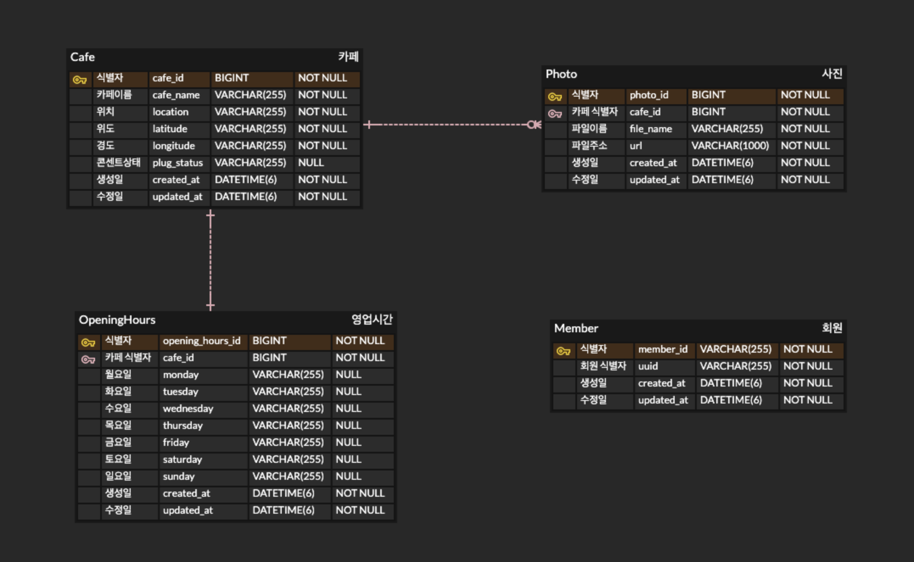

# Cafehub(카페허브)

코딩하기 좋은카페, 카페허브

App Store: 

Play Store:

## Database

## [API Documentation](https://cafehub-dev.nogamsung.com/swagger-ui/index.html)

#### [API 문서 관련 설명](./doc/api_document_explanation.md)

## Cooperation
- [Git Flow](https://techblog.woowahan.com/2553/)
- [Commit Convention](https://doublesprogramming.tistory.com/256)
- [Github Issue & Pull Request](https://velog.io/@junh0328/%ED%98%91%EC%97%85%EC%9D%84-%EC%9C%84%ED%95%9C-%EA%B9%83%ED%97%88%EB%B8%8C-%EC%9D%B4%EC%8A%88-%EC%9E%91%EC%84%B1%ED%95%98%EA%B8%B0)

## Contributors

| 사진 | 이름 | 깃허브 |
| :-: | :-: | :-: |
|  | 안검성 | [gs97ahn](github.com/gs97ahn) |
| {width=150 height=150} | 김나현 | [nahyeon99](github.com/nahyeon99) |